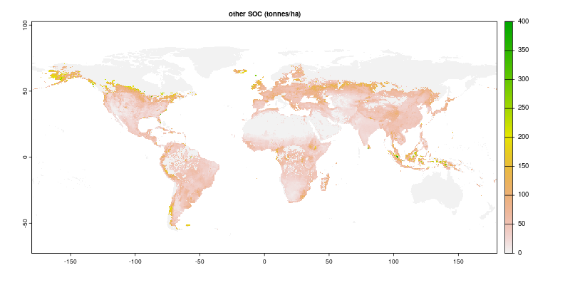

```{r, echo = FALSE}
knitr::opts_chunk$set(collapse = TRUE, comment = "#>")
```

`mrorganic` is a data processing package based on the [`madrat`](https://github.com/pik-piam/madrat) data processing framework (indicated
by its prefix `mr`) with the purpose to estimate soil organic carbon (SOC) as well as above- 
and belowground biomass or their use in different type of more aggregated models.

From the [`madrat`](https://github.com/pik-piam/madrat) universe it inherits various traits such as a prescribed data processing structure,
data caching, metadata collection and handling, data consistency checks as well as certain
flexibility in spatial aggregation.

# Installation

The easiest way of installing it is to add the PIK-CRAN repository and install it from there:

```{r, echo = TRUE, eval = FALSE}
# enable R to discover and download R packages from PIK
options(repos = c(CRAN = "@CRAN@", pik = "https://rse.pik-potsdam.de/r/packages"))
install.packages("mrorganic")
```

This should install the package with all its dependencies.

# How to use it 

Like most `madrat`-based packages, `mrorganic` includes a function that runs all data preparation steps and creates a tgz
archive which includes a collection of all data sets. For `mrorganic` some plots are also included. Run it like this:
```{r, echo = TRUE, eval = FALSE}
library(mrorganic)
path <- retrieveData("organic", rev = 2.1, regionmapping = "regionmappingGTAP11.csv")
message(path, " created.")
```

The revision number `rev` specifies the data revision to be produced. This mandatory argument is used to distinguish older from newer revisions and potentially allow to generate different data revisions with the same data package. As `mrorganic` can only generate a specific data revision with a specific version of a package, this setting here is solely used as a consistency check, that you indeed use the proper package version for the data revision you are interest in. A data revision different to the one supported in the used package version will result in an error informing the user to use a different package version for other data revisions.

The `regionmapping` argument is used to define for which regions the data should be prepared. For instance, if a mapping from ISO3 countries to the GTAP11 regions is used, the datasets will be aggregated at the level of the GTAP11 world regions. If this is not set explicitly it uses an exemplified world regional aggregation with 12 world regions as provided by the `madrat` package itself. It is also possible to introduce the user’s own mappings and use them here.

The above instruction `retrieveData` calls internally the function `fullORGANIC` which is part of this package and contains the script to create the data collection. Here it is possible to see which components the final data product consists of and to make adjustments. From the command line you can call its documentation via `?fullORGANIC` or have a look at the code via `mrorganic:::fullORGANIC`. 

Please be aware that running the full data processing for the first time is quite resource intensive. While it does not necessarily require a high end CPU, it certainly requires quite a lot of free space on disk for temporary files (> 200 GB) as well as time to compute (5-10 hours). Consecutive runs will usually be much faster as all unchanged data will be read from cache files. Files will be partly written in your system temp folder, partly in the MADRaT mainfolder (see `getConfig("mainfolder")`).

The total processing will create a file called `rev2.1_4a934e12_organic.tgz` where the file name consists of the revision number, followed by a hash of the used region mapping (to unambiguously identify it) and the name of the data collection. Running it with a different version of the package will potentially come with a different data revision. Running it with a different region mapping will generate a different region mapping hash. Similarly, changes in the source data sets would affect the results of `mrorganic`. However, the data sources used in this package all are assumed to be static and no changes are expected.

# How to run single components

In interactive use of the package, it is often handier to only run specific components of the data processing rather than generating the whole data collection. In this case the different "calculation functions" of the package come into play. Each data collection (as generated via `retrieveData`) calls a series of calculation functions where every calculation function generates a single data set. As calculation functions can be using other calculation functions as their data source not all data sets generated by calculations functions will necessarily end up in the final data collection. 

Calculation functions always start with the prefix `calc` followed by the name of the calculation and can be called via `calcOutput`, e.g. `calcSOCbyLandType` contains the calculation of soil organic carbon contents by land type and can be called via `calcOutput("SOCbyLandType")`.

Calling the respective functions via the `calcOutput` wrapper function embeds the calculations into the `madrat` universe and enriches the computations by the features of the framework such as caching, metadata handling and advanced aggregation options. `calcSOCbyLandType` is for instance internally computing the data with 0.25°x0.25° resolution. However, for some applications, it might be actually desired to have the data available on ISO country level or world regions. `calcOutput` can directly compute the data on all these resolutions:

```{r, echo = TRUE, eval = FALSE}
# gridded data with original resolution of 0.25deg x 0.25deg
socGrid <- calcOutput("SOCbyLandType", aggregate = FALSE)
# data on ISO country level
socCountry <- calcOutput("SOCbyLandType", aggregate = "country")
# data on world regional level
socRegion <- calcOutput("SOCbyLandType", aggregate = TRUE)
# or simply
socRegion2 <- calcOutput("SOCbyLandType")
```

The first time this calculation is run, the data will be computed from scratch. In all follow-up calculations, the data will be read from cache.

# Data processing in `mrorganic`

`mrorganic` generates two primary data products:

* Soil organic carbon data split by land types
* aboveground and belowground biomass split by land types

The overall methodology is in both case rather comparable and can be mostly seen in the function `toolAggregateByLandType`. The basic idea is that land type specific data on a lower resolution can be estimated from land-type unspecific high resolution data through land-type specific weighted aggregation. For instance the soil organic carbon content of cropland in a country can be estimated by taking the average soil organic carbon content of all high resolution cells of that country which are mapped as cropland. This calculation is imperfect mainly due to two reasons: 

1. In case of mixed occurrence of land types in a cell this method is unable to disentangle the data and is instead assuming the same value for all land types in this cell.
2. The method depends on a good spatial match of land type information to the data to be aggregated which is not necessarily given (e.g. the land type data set might suggest cropland in spots where the soil organic carbon data set is based on a different land type).

Due to these limitations it is important to evaluate the quality of the resulting data set with respect to the given task. For instance, in the case of the biomass map, the land cover data used do not allow to produce suitable maps for grassland or cropland. While the quality of the data might be suitable for some applications, it most likely will not suffice for others.

# Land type data

As spatial land type information serves the [ESA CCI LandCover Map for 2010](http://maps.elie.ucl.ac.be/CCI/viewer/index.php) which provides high resolution land cover information. For aggregation of soil organic carbon the [detailed land cover classes](http://maps.elie.ucl.ac.be/CCI/viewer/download/ESACCI-LC-Legend.csv) are aggregated to three classes: cropland, grassland and other. For aggregation of above- and belowground biomass in total 6 land classes are being used: cropland, grassland, forest, other natural vegetation (othernatveg) and residual. The mapping of detailed classes to these aggregated ones can be found in the function `calcLandTypeAreas`.  

-------------------------------------------------------

{width=600px}

-------------------------------------------------------

{width=600px}

-------------------------------------------------------

{width=600px}

-------------------------------------------------------

{width=600px}

# Soil Organic Carbon data

Soil organic carbon calculations build on the [Global Soil Organic Carbon Sequestration Potential Map (GSOCseq)](https://www.fao.org/soils-portal/data-hub/soil-maps-and-databases/global-soil-organic-carbon-sequestration-potential-map-gsocseq/en/) from FAO. Data is aggregated weighted with ESA CCI land cover information first to 0.25°x0.25°. From this resolution, which serves as spatial base resolution for this study, the data can be further aggregated in the same way to countries or world regions.

As already shown above the resulting data can be retrieved in the following way:


```{r, echo = TRUE, eval = FALSE}
# gridded data with original resolution of 0.25deg x 0.25deg
socGrid <- calcOutput("SOCbyLandType", aggregate = FALSE)
# data on ISO country level
socCountry <- calcOutput("SOCbyLandType", aggregate = "country")
# data on world regional level
socRegion <- calcOutput("SOCbyLandType", aggregate = TRUE)
# or simply
socRegion2 <- calcOutput("SOCbyLandType")
```

-------------------------------------------------------

{width=600px}

-------------------------------------------------------

{width=600px}

-------------------------------------------------------

{width=600px}

# Aboveground and Belowground Biomass data
The aboveground and belowground biomass dataset is based on the [Spawn et al.](https://doi.org/10.3334/ORNLDAAC/1763) Global Aboveground and Belowground Biomass Carbon Density Maps for the Year 2010. While `mrorganic` is intended to download all data sources on its own, the data archive for the Spawn data set at ORNL DAAC requires a manual download from the website. Therefore, `mrorganic` will guide you at its first execution through the manual download process. After supplying the path to the downloaded data set `mrorganic` will continue its automatic data processing.

The final data product is computed by `calcBiomassLandType` which can be called via the `calcOutput` wrapper wit the type argument `BiomassbyLandType`:
```{r, echo = TRUE, eval = FALSE}
library(mrorganic)
biomassAbove <- calcOutput("BiomassbyLandType", subtype = "aboveground")
biomassBelow <- calcOutput("BiomassbyLandType", subtype = "belowground")
```

The function comes with two subtypes: `aboveground` and `belowground`. Analogous to the soil organic carbon calculations, the `aggregate` argument can be used again to extract the data in different resulting aggregation levels.

-------------------------------------------------------

{width=600px}

-------------------------------------------------------

{width=600px}


# Acknowledgement
The development of this package was supported by the Organisation for Economic Co-operation and Development. The data and maps used in the package are without prejudice to the status of or sovereignty over any territory, to the delimitation of international frontiers and boundaries and to the name of any territory, city or area.
